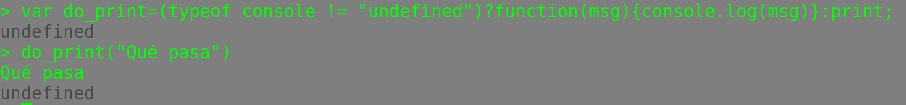
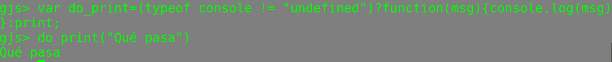
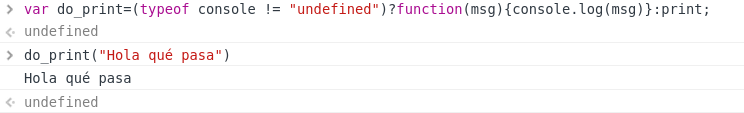
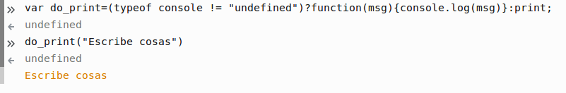

# ¿JavaScript? Pero si es muy fácil

##Objetivos de este capítulo
-   Aprender qué es JavaScript
-   Entender la presencia de múltiples implementaciones y lo que ello significa. 
-   Aprender la sintaxis de JavaScript
-   Realizar un pequeño ejemplo en JavaScript

## Introducción
Lejos de ser solamente un lenguaje para el navegador,
[JavaScript](https://es.wikipedia.org/wiki/JavaScript) tiene una ventaja
frente a otros lenguajes de programación: Está *en todas partes*. No hay
ordenador sin navegador, ni hay navegador sin JavaScript. Se puede
ejecutar hasta en el navegador de las consolas de videojuegos; desde la
madurez de [node.js](http://nodejs.org), es el único lenguaje que
permite ejecutar aplicaciones en cliente y servidor, así que se ha
convertido en uno de los lenguajes más útiles para desarrollo en
Internet.

Esto se debe en parte a que ha sido definido como un 
[estándar ECMA (denominado ECMAScript)](https://es.wikipedia.org/wiki/ECMAScript) lo
que da lugar a muchas implementaciones diferentes, que son, además,
independientes del fabricante. Y también en parte a que suele usar un
conjunto de objetos estándar, que no son estrictamente parte de un
lenguaje, que se pueden usar para añadir funcionalidad a una aplicación.
Muchas aplicaciones complejas, como GMail o Google
Apps dependen de estos objetos para crear
aplicaciones en la web que se comporten como si se ejecutaran en un
sistema operativo nativo; a estas aplicaciones se les ha denominado
últimamente *Rich Internet Applications*.

>Su popularidad ha hecho que últimamente empiece a usarse también como
>lenguaje *empotrado* en diferentes aplicaciones. Por ejemplo,
>[el servidor web `nginx` incluye un intérprete que puede evaluar JS para generar contenido](https://www.nginx.com/blog/nginscript-why-our-own-javascript-implementation/),
>[MineCraft tiene un mod que permite programar en JS](https://github.com/walterhiggins/ScriptCraft/blob/master/docs/YoungPersonsGuideToProgrammingMinecraft.md). También
>se puede usar para
>[programar macros en LibreOffice](https://help.libreoffice.org/Common/Scripting/es)
>y en las [Google apps](http://drive.google.com); al acceder al
>interfaz de programación de Google Drive se accede en realidad a un
>entorno de programación en JS. 

Además, a diferencia de otros lenguajes, es muy fácil crear una
aplicación distribuida, cliente/servidor o [MVC](https://es.wikipedia.org/wiki/Modelo%E2%80%93vista%E2%80%93controlador) con JavaScript. Tanto por
su integración con el navegador, parte inseparable de la web, una
arquitectura cliente-servidor, como por los objetos que suele tener el
mismo, crear una aplicación de este tipo es casi trivial y ha dado
lugar a un estilo de programación denominado
[Ajax](https://es.wikipedia.org/wiki/Ajax), que se verá más adelante.

Para ejecutar JavaScript no hace falta más que un navegador, pero
también hay entornos para trabajar con él de forma autónoma, el más
conocido de los cuales es [Node](https://nodejs.org/en), pero con otros representantes tales como el
[Mozilla SpiderMonkey](https://developer.mozilla.org/en-US/docs/Mozilla/Projects/SpiderMonkey)
y el [Rhino](https://developer.mozilla.org/en-US/docs/Mozilla/Projects/Rhino), éste
último basado en Java; [hay una lista de intérpretes completa que se puede usar](https://developer.mozilla.org/en-US/docs/Web/JavaScript/Shells).
Conviene instalar alguno de ellos para poder ejecutar desde línea de
órdenes los programas de
ejemplo;

>Aunque, como hemos dicho arriba, no te va a hacer falta más que el
>navegador para muchos de ellos.

por ejemplo, para instalar el primero habrá que ejecutar desde
la consola de administrador o superusuario:

~~~~~~
	bash% sudo apt-get install nodejs
~~~~~~

> En otros sistemas operativos o versiones de linux habrá primero que
> localizar el paquete correspondiente, que seguramente se llamará
> nodejs o algo muy parecido.

O, si se quiere instalar

~~~~~~
	bash% sudo apt-get install rhino
~~~~~~

o

~~~~~~
	bash% sudo apt-get install libmozjs-24-bin
~~~~~~

que instalará SpiderMonkey en el fichero ejecutable `js24`.

Hay algunas diferencias entre los intérpretes, sobre todo en cualquier
función que tenga que ver con la entrada/salida. Conviene consultar la
página de manual del intérprete para ver cómo se hace específicamente en
cada caso; en general, los ejemplos que se incluyen aquí funcionan
correctamente en `js` o `rhino`.

> Por lo que he probado, SpiderMonkey, Rhino, `gjs` y KJSCMD se instalan
> fácilmente en Ubuntu; no hay más que hacer `apt-cache search javascript`
> y salen esos y alguno más. Fedora Core es un poco más rácano
> en cuanto a entornos: aunque los puedes instalar bajándote los fuentes y
> compilando, el que está disponible en los repositorios es uno llamado
> sólo `js`, aparentemente el SpiderMonkey. Para instalarlo, escribir
> `yum install js`. El Gnome Shell (incluido en la versión 3.0 de Gnome)
> incluye también un intérprete de JavaScript como lenguaje nativo, y con
> él se pueden desarrollar pequeños applets. Este intérprete, que está
> instalado por defecto junto con el entorno, se denomina `gjs`, está
> basado en SpiderMonkey y tiene la ventaja de que está integrado con
> todas las librerías de Gnome, de forma que se pueden hacer programas
> tales como [este, que crea una ventana con un botón](https://github.com/JJ/curso-js/tree/master/code/g.js) sin
> necesidad de instalar ningún módulo adicional. Éste intérprete es el que
> usa desde `lg` (*looking glass*), una consola de depuración de Gnome al
> estilo de la consola del navegador que se puede ejecutar desde entorno
> pulsando Alt-F2 y escribiendo `lg`. Finalmente, Windows incluye [un programa de línea de órdenes denominado `cscript` y  `wscript`](http://stackoverflow.com/questions/686377/windows-command-line-javascript)
> que, una vez más, tiene ciertas diferencias con respecto al resto de los
> intérpretes (todo lo relacionado con I/O); en realidad se trata de
> JScript, otra implementación del estándar ECMAScript. Finalmente,
> para instalar `kjs`, el intérprete JavaScript parte del entorno KDE,
> tendrás que instalar todos los binarios de KDE con `sudo apt-get install kdelibs-bin`.

En cuanto a los navegadores, puede que haga falta activar JavaScript
para que lo entiendan. Por ejemplo, en Firefox hay que activarlo usando
Edit → Preferencias → Contenido → Activar JavaScript. Normalmente
está activado por omisión. Por otro lado, veremos ejemplos
principalmente de programas que se pueden usar desde el intérprete, y
merece la pena instalarse uno.

Si usas Eclipse, puede que te venga bien el [plugin JSDT](http://www.eclipse.org/webtools/jsdt/).

> Igual al atento lector le funciona correctamente. Yo no conseguí
> echarlo a andar.

Por otro lado, el `emacs` va de lujo. NetBeans
tiene también [soporte para JavaScript](https://netbeans.org/kb/73/ide/javascript-editor.html),
simplemente seleccionando este lenguaje para un nuevo fichero. El editor
detecta la estructura del fichero e incluso analiza el código indicando
los problemas, indentando automáticamente y emparejando paréntesis y
llaves.

En realidad, esa integración con el navegador puede que haya estorbado a
la aceptación de JS como un lenguaje *decente*; tampoco ha ayudado que
la mayoría de las librerías que se hayan desarrollado estén relacionadas
precisamente con la Web, y no tenga una librería decente para, pongamos
por caso, acceder a bases de datos. Pero también ha permitido que el
lenguaje siga siendo *pequeño*, y se haya desarrollado principalmente a
base de añadir objetos y clases externas al mismo. En resumen, que en el
marco de eso que se ha venido en llamar [web 2.0](https://es.wikipedia.org/wiki/Web_2.0) y especialmente desde que
se ha popularizado Node, JS se ha convertido en
adulto, y merece la pena estudiarlo como cualquier otro lenguaje.

>Por último está el [1st JavaScript Editor](http://www.yaldex.com/JSFactory_Pro.htm), que es de pago, pero
>pueden conseguirse versiones de evaluación gratuitas. Desde aquí no
>recomendamos software privativo para desarrollo de software, sin
>embargo. 

## Trabajando con los intérpretes de órdenes

Ya hemos comentado que es prácticamente seguro que tu ordenador tenga
ya incluido un intérprete de órdenes, sea en el navegador o sea en
forma de intérprete para la línea de órdenes. Vamos usarlo para ver
nuestras primeras órdenes en JavaScript.

~~~~~~
    var do_print=(typeof console != "undefined")?function(msg){console.log(msg)}:print;
	do_print("Cool cool cool")
~~~~~~

Además, este programa es bastante característico de las
características únicas de JS y se puede ejecutar sin variación en
*node*

en *gjs* que se instala en tu sistema si usas Gnome:

en Chromium (la versión libre de Chrome, tendría que ser similar en
él)

y en el navegador libre Firefox
.

Lo que hace este programa es definir una función, almacenarla en la
variable `do_print` y usarla más tarde como tal función. Del tirón te
muestra que JS es un lenguaje *funcional* donde las funciones son
"ciudadanos de primer orden" y se puede usar una función en el mismo
lugar donde se usaría cualquier otra estructura de datos. Pero,
además, vemos que se usa `var` para definir una variable, o más bien
el ámbito de una variable, porque en JS no es estrictamente necesario
definirlas y que JS usa *tipado* dinámico: no hace falta asignarle un
valor estático al tipo de la variable. `var zipi` es todo lo que se
necesita para usar la variable `zipi`, aunque si aparece `zipi` por
primera vez en la orden `zipi=0` nadie va a protestar.

La asignación equivale a una sentencia `if-then-else`. Pregunta por el
tipo (`typeof`) la variable `console`. También aquí podemos ver que
los paréntesis son opcionales: `typeof console` es igual que
`typeof(console)`. Si no existe `console`, su tipo será `undefined`,
`console` es un objeto que permite acceder a escribir cosas en el
terminal. Por eso si el tipo no es `undefined`, definimos una función
sobre la marcha, prueba una vez más de la naturaleza funcional de
JS. Después de `?` estará el valor devuelto por la expresión cuando
ésta sea verdadera (como el `then` en un `if`) y se construye una
función sobre la marcha con la palabra clave `function`, un parámetro
`msg` y la expresión correspondiente. es decir, la función se puede
definir y asignar en una variable así:

~~~~~~
	var usa_consola=function(msg){console.log(msg)};
~~~~~~

Tras el `:`, está la otra opción. En muchos intérpretes en JS no
existe el objeto `console`, pero para escribir en el terminal se usa
la función `print`, que es la que se devuelve. Es decir, en algunos
intérpretes de los anteriores usará `console.log` y en otros, en
realidad, sólo en `gjs`, `print`.

>la definición de la función en realidad es una exigencia del modelo
>de seguridad de los navegadores. En node bastaría con haber devuelto,
>igual que con `print`, simplemente `console.log`. 

La segunda línea usa la función definida como tal función:
`do_print("Aquí pongo lo que sea")`. En los diferentes intérpretes se
ve también algún valor tal como `undefined`; en cada uno de los casos
imprime el valor que devuelve la función, ninguno. Si la función
hubiera devuelto algún valor al ejecutarse se habría impreso en esa
línea.

>Como ejercicio, se puede probar a ejecutar esa misma función en algún
>intérprete que se tenga a mano: el de CouchDB, Rhino o SpiderMonkey
>si es que se tienen instalados. 

## Primer programa en JavaScript

Tras ver cómo funcionan los intérpretes y tenerlos a mano por si
hubiera que probar alguna orden aislada, vamos a hacer un programa
completo, el clásico. Nuestro primer programa tiene dos versiones, al
menos. Empecemos por una de ellas
~~~~~~
#!/usr/bin/js
print( 'Hola, Mundo' ); // console.log en vez de print si "js" es node.
~~~~~~

El programa en sí comienza en la segunda línea, y en él podemos ver que
la sintaxis de JS es bastante parecida a la del lenguaje C y, para el
caso, también 
al Java. La primera línea, clásica de los lenguajes de *scripting* en
Linux, indica cuál va a ser el intérprete que se va a usar para el
resto del fichero.

>Si tienes instalado `node` `/usr/bin/js` será el intérprete de
>node. Si no lo tienes instalado, puede ser algún otro intérprete,
>como rhino o SpiderMonkey (en versiones más antiguas de Linux). 

Este programa producirá (siempre que lo hagamos ejecutable con
`chmod +x hola.js` previamente):

~~~~~
jmerelo@vega:~/txt/docencia/AAP/Temario$ ./hola.js Hola, Mundo
~~~~~

Podemos probar con diferentes intérpretes que tengamos instalados.

~~~~~~
jmerelo@penny:~/code$ gjs hola.js
Hola, Mundo
jmerelo@penny:~/code$ rhino hola.js
Hola, Mundo
jmerelo@penny:~/code$ js24 hola.js
Hola, Mundo
~~~~~~

Como hemos visto antes, escribir en la consola no forma parte del
conjunto estándar de órdenes de JS, precisamente por todos los
entornos posibles en los que se puede encontrar. Por eso este programa
tiene una
[segunda versión](https://github.com/JJ/curso-js/blob/master/code/holakase.js)
en node.js habría que cambiar `print` por `console.log`, o 
tendremos un error. También se puede usar directamente
[la consola JavaScript online](http://jsconsole.com/?console.log%28%22Es%20una%20prueba%22%29)
para ejecutarlo; `console.log` es la versión de la orden de imprimir
que funciona en la mayoría de los intérpretes más conocidos (Node y
los del navegador).

>Con `kjs` habrá que ejecutarlo también directamente
>desde la línea de órdenes; con un fichero da un error y no he encontrado
>ningún manual específico sobre él, así que no aconsejo usar esa versión
> de JS. Esto, sin embargo, parece funcionar: `kjs -e
>'print("Hola,mundo")'`. 

Por otro lado, [este programa, `hola-g.js`, sería equivalente para el intérprete `gjs` que viene con Gnome](https://github.com/JJ/curso-js/tree/master/code/hola-g.js).

Para ejecutarlo desde el navegador habrá que hacer un poco más de
historia, pero tampoco tanto. Primero, lo podemos ejecutar
directamente. La combinación de teclas *Mayúsculas-Control-K* abre, en
la parte baja de la ventana de Firefox, una consola de JavaScript. Donde aparece
">>", se escribe simplemente `console.log("Qué bonito")` y dará como
resultado algo así:

~~~~~~
    console.log("Qué bonito")
	undefined
	Qué bonito
~~~~~~

En navegadores modernos la consola también completará automáticamente
las órdenes mostrándote todas las opciones posibles.
>En Chromium y Chrome se puede escribir directamente sobre la ventana,
>no en la línea inferior *de interacción* como en Firefox.

Arriba, el
`undefined` indica simplemente que la función `console.log` no
devuelve ningún valor, como ya hemos visto. La línea siguiente es la que muestra el
resultado de ejecutar la orden.

Segundo, podemos ejecutar JavaScript como parte de una página web. Lo
vemos en [este ejemplo (darle a ver fuente para ver el código)](https://github.com/JJ/curso-js/tree/master/code/hola-js.html)
donde se incluye el programa en JS de esta forma:

~~~~~

~~~~~

El problema es que, en este caso, la orden `print` se interpretaría como
impresión por impresora y habrá que cambiarla por otra que signifique
lo mismo, escribir en el dispositivo de salida que se esté
[usando](https://github.com/JJ/curso-js/tree/master/code/hola-js-2.html):

~~~~~
document.writeln('Hola, Mundo')
~~~~~

Lo que también se puede escribir directamente
[así](https://github.com/JJ/curso-js/tree/master/code/hola-js-3.html) y puedes [ver en acción en JSFiddle](https://jsfiddle.net/jjmerelo/L4z134ox/) :

~~~~~

~~~~~

Estos programas se pueden editar con cualquier editor de texto, Emacs,
gedit o Notepad++; también con los entornos integrados, que te
ofrecerán ventajas adicionales como completar las variables y los
nombres de los comandos.

>El siguiente
>[programa](https://github.com/JJ/curso-js/tree/master/code/hola-all.js)
>funcionaría al menos en 4 intérpretes, aparte de en la consola de algunos navegadores:

~~~~~javascript
var write;

if ( typeof console != "undefined" ) {
    write = console.log;
} else {
    write = print;
}

write( 'Hola, Mundo' );
~~~~~

>Si los tienes instalados, prueba esta nueva versión que es, por otro
>lado, la versión en programa de las sentencias que hemos programado
>anteriormente. 

En general, conviene ser consciente de que JavaScript incluye tantos
las órdenes propias del lenguaje, definidas en los estándares
ECMAScript, como *objetos* que son propios de cada implementación, que
dependerán de dónde esté incrustado o de qué intérprete se use en cada
momento. Prácticamente todas las órdenes de entrada/salida se
implementarán mediante objetos u órdenes específicas de cada
lenguaje. Por eso el clásico "Hola mundo" no acaba de ser el mejor
ejemplo de primer programa para este lenguaje, aunque también nos ha
servido para ver las diferencias entre las diferentes
implementaciones. Conviene en cada caso consultar el manual de
referencia del intérprete que se esté usando, sin embargo, para que no
haya problemas.

>Habiendo tantos intérpretes, ¿cuál usar? Aparte de que este
>libro/curso se concentra en `node.js`, éste suele ser el intérprete
>más popular y que más usuarios y desarrollo tiene, por lo que
>aconsejamos que se use y la mayoría de los ejemplos lo van a
>usar. Sin embargo, tanto *rhino* como *SpiderMonkey* son
>perfectamente adecuados, con pequeños cambios (como `print` →
>`console.log`) para aprender JavaScript trabajando fuera del
>navegador. 

## Estructuras de control en JavaScript

Vistas ya las mil y una formas de escribir cosas en la pantalla y
ejecutar un programa con los mil y un intérpretes de javascript,
procedamos a temas más escabrosos, como lo que viene siendo hacer algo
*realmente*. Por ejemplo, un bucle que cree una tabla HTML, como se hace
en el siguiente
[programilla](https://github.com/JJ/curso-js/tree/master/code/tabla.js):

~~~~~~javascript
#!/usr/bin/js24

var tabla="table";
var celda="td";
var fila="tr";
var matriz = [1,2,3];
print( "<"+tabla+">");
for (i in matriz ) {
  print( "\t<"+fila+">");
  for ( j in matriz ) {
    print ("\t\t<"+celda+">"+matriz[i]*matriz[j]+"</"+celda+">");
  }
  print ("\t</"+fila+">\n");
 }
print ("</"+tabla+">");
~~~~~~

>Como se puede ver en la primera línea, `#!/usr/bin/js24`, se está
>usando SpiderMonkey como intérprete. Rhino y gjs usarán `print` de la
>misma forma. Para usar node o desde la consola del navegador,
>sustituye `print` por `console.log`.

Este programa tiene dos bucles anidados, que imprimen un producto dentro
de una tabla. La salida será tal que así (ver el fuente para la
estructura):

<table>
	<tr>
		<td>1</td>
		<td>2</td>
		<td>3</td>
	</tr>

	<tr>
		<td>2</td>
		<td>4</td>
		<td>6</td>
	</tr>

	<tr>
		<td>3</td>
		<td>6</td>
		<td>9</td>
	</tr>

</table>
	

El programa es menos complicado de lo que parece. Para declarar
variables en JS se usa el genérico `var`, porque JavaScript tiene
tipificado dinámico, asignando a una variable un tipo determinado
dependiendo de su valor. `var` declara un ámbito: simplemente usando una variable aparece
mágicamente, como se hace en las dos variables de bucle `i` y `j`.

>Dependiendo del intérprete, el uso de esas variables puede provocar
>un *warning*. En `gjs`, por ejemplo, dirá 

~~~
Gjs-Message: JS WARNING: [tabla.js 8]: assignment to undeclared variable i`
~~~

Con las matrices ocurre igual (es decir, se declaran y se
les asigna valor directamente) : `matriz` lo es, y simplemente se
declaran sus valores entre corchetes. Ojo con los nombres de variables,
que a diferencia de otros lenguajes, distinguen entre mayúsculas y
minúsculas. `esta_variable` es diferente de `esta_Variable`.

JS puede usar un tipo de bucle que tienen la apariencia habitual (en
lenguajes derivados del C), y se pueden usar igual que en C, pero
haremos un bucle que recorra la matriz, usando un *iterador* `i`, que en
este caso se comporta como una variable de bucle de las de toda la vida.
Usamos el `+` para concatenación de cadenas, y poco más. El resto es
como el C, o el Java. De hecho, se pueden usar los bucles clásicos con
comparación e incremento, como se muestra en
[`tabla1.js`](https://github.com/JJ/curso-js/tree/master/code/tabla1.js):

~~~~~~javascript
var tabla="table";
var celda="td";
var fila="tr";
print( "<"+tabla+">");
for (i=1; i<=3; i++ ) {
    print( "<"+fila+">");
    for ( j=1; j<=3; j++  ) {
	print ("<"+celda+">"+i*j+"</"+celda+">");
    }
    print ("</"+fila+">\n");
}
print ("</"+tabla+">");
~~~~~~

Aunque queda un poco torpe tanto `<>`... Vamos a reducir un poco el
programa, haciéndolo [más elegante](https://github.com/JJ/curso-js/tree/master/code/tabla2.js)
(aunque más largo: no se puede tener todo):

~~~~~~javascript
var matriz = [1,2,3];
print( marca('table'));
for (i in matriz ) {
  print( marca( 'tr' ));
  for ( j in matriz ) {
    print ( celda(matriz[i]*matriz[j]));
  }
  print ( finmarca('tr'));
}
print (finmarca('table'));

function marca( m ) {
  return "<"+m+">";
}

function finmarca( m ) {
  return "</"+m+">";
}

function celda( contenido ) {
  return marca("td")+contenido+finmarca("td");
}
~~~~~~

La principal diferencia con respecto al anterior es el **uso de
funciones**. Las funciones en JS tienen una estructura bastante clásica:
`function` nombre-de-función (param1, param2...).
>Ya hemos visto al principio de este capítulo que también se pueden
>definir sobre la marcha y asignares a una variable.
Una vez más, se nota
que JS no es un lenguaje con tipos estáticos, pudiendo pasar los parámetros
sin tipo, y adaptándose dentro de la función al tipo necesario. Se pasan
por valor, es decir, que las modificaciones al parámetro formal no se
trasladan a la variable que se use. Además, se pueden declarar donde a
uno le dé la gana. Para llamarlas tampoco hay que hacer nada especial,
se usa el clásico paréntesis. La salida es exactamente la misma que
antes. El también clásico `return` devuelve un valor.

El ámbito de las variables es el bloque donde aparecen o se declaran,
pero hay que tener en cuenta que, a efectos de JS, una página web es un
*programa*. Se pueden declarar variables en la cabecera del documento
HTML, y estarán accesibles en cualquier otro sitio, siempre que esté ms
adelante en el documento. También habrá que tener en cuenta, en caso de
que esté incluido en una página web, que aunque la declaración de una
subrutina afecte a todo el programa, puede que esa parte de la página no
se haya cargado todavía, con lo que no estará disponible. Una vez más,
la programación distribuida no es totalmente igual a la programación en
otros lenguajes.

Sin embargo, la forma anterior de realizar el programa corresponde a
una estructura más *tradicional* y semejante a lenguajes no
funcionales como el C o el Java. Hay otra forma de hacerlo, que usa la
capacidad de JS de trabajar con funciones como estructuras de datos de
primera clase, será [la versión final del programa anterior](https://github.com/JJ/curso-js/tree/master/code/tabla-final.js):

~~~~~javascript
var matriz = [1,2,3];
var wrap = function(m, start, end ) { return start+m+end; }
var marca = function( m ) { return wrap(m, "<",">"); }
var finmarca = function( m ) { return wrap(m,"</",">"); }
var celda = function( contenido ) { 
    return wrap( contenido, marca("td"), finmarca("td"));
}
var do_print=(typeof console != "undefined")
    ?function(msg){console.log(msg)}
    :print;

do_print( marca('table'));
matriz.forEach( function(elemento_i) {
    do_print( marca( 'tr' ) );
    matriz.forEach( function(elemento_j ) {
	do_print ( celda(elemento_i*elemento_j));
    });
    do_print( finmarca( 'tr' ));
})
do_print (finmarca('table'));
~~~~~

## Bibliografía 

>Los enlaces en este texto son a la biblioteca de la UGR. Es posible
> que el recurso electrónico o libro esté también disponible en alguna
> biblioteca cercana; si no, habrá que adquirirlo o pedirlo prestado
> usando el método habitual.

Hay dos libros fundamentales para aprender JS, aunque están muy
enfocados a JS en el navegador:[*JavaScript: The Definitive Guide*, el libro del rinoceronte](http://bencore.ugr.es/iii/encore/record/C|Rb2011082|Sjavascript+definitive+guide|Orightresult|X2?lang=spi&suite=pearl),
editado por O'Reilly, que está [disponible como recurso electrónico en la UGR](http://proquest.safaribooksonline.com/9781449393854?uicode=goliat)
y [*JavaScript Bible, de Danny Goodman*, un tocho considerable](http://bencore.ugr.es/iii/encore/record/C|Rb1987808|Sjavascript+bible|Orightresult|X5?lang=spi&suite=pearl),
en el que hay de todo, y que viene con un útil CD con ejemplos. También
está como [recurso electrónico](http://proquest.safaribooksonline.com/?uiCode=goliat&xmlId=9780470526910).
Hay [muchos más recursos, algunos de ellos disponibles de forma electrónica](http://bencore.ugr.es/iii/encore/search/C|Sjavascript|Orightresult|U1?lang=spi&suite=pearl).

Como recursos adicionales, [las páginas de JavaScript en Mozilla.org](https://developer.mozilla.org/en-US/docs/JavaScript/About_JavaScript?redirectlocale=en-US&redirectslug=About_JavaScript),
el [estándar completo](http://www.ecma-international.org/publications/standards/Ecma-262.htm),
y el [curso de JavaScript de Víctor Rivas Santos](http://geneura.ugr.es/~victor/cursillos/javascript/js_intro.html).
